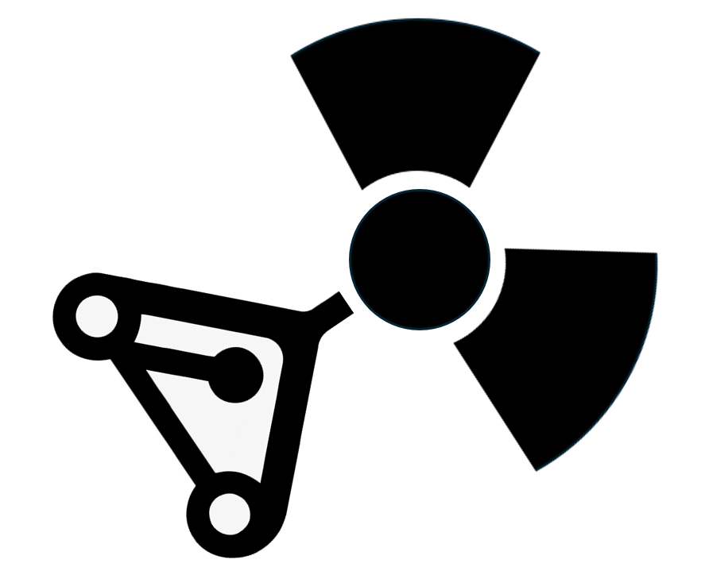

<div align="center">
  
  <h1>Gitronics</h1>
  <p><strong>Build MCNP neutronics models from modular, version-controlled components.</strong></p>

  [](https://github.com/Fusion4Energy/gitronics/actions/workflows/ci.yml)
  [](https://fusion4energy.github.io/gitronics/latest/)
  [](https://pypi.org/project/gitronics/)
  [](LICENSE)
</div>

---

Gitronics lets you decompose a monolithic **MCNP** input file into independent, version-controllable components — universe filler models, an envelope structure, and separate data cards — and reassemble them at build time via a YAML configuration.

**Full documentation: [fusion4energy.github.io/gitronics](https://fusion4energy.github.io/gitronics/latest/)**

## Why?

| Problem with monolithic models | Gitronics solution |
|---|---|
| `git diff` is unreadable | Each component is a separate file |
| Running variants means copying the whole file | Override only the fields that change |
| Teams can't work on sub-models in parallel | Each filler model is independent |
| Hard to know exactly what was run | Commit hash and timestamp written into every assembled file |

## Installation

```bash
pip install gitronics
```

Requires Python 3.9+. Pre-built wheels for Linux, macOS, and Windows are published to PyPI — no Rust toolchain needed.

## Quick start

**Migrate an existing model:**

```bash
gitronics migrate path/to/my_model.mcnp --output-path ./my_project
```

**Build a model:**

```bash
gitronics build my_project/configurations/baseline.yaml --output-path my_project/output/
```

**Get help:**

```bash
gitronics --help
gitronics build --help
gitronics migrate --help
```

## Project layout

```
my_project/
├── configurations/
│   ├── baseline.yaml          ← declares which fillers go where
│   └── variant_A.yaml         ← inherits baseline, overrides selected envelopes
├── output/
│   └── .gitignore
└── reference_model/
    ├── envelope_structure.mcnp
    ├── filler_models/
    │   ├── component_A.mcnp
    │   └── component_B.mcnp
    └── data_cards/
        ├── materials/
        ├── sources/
        └── tallies/
```

## Configuration example

```yaml
project_roots: [..]

envelope_structure: envelope_structure
source: dt_plasma
materials: [all_materials]
tallies: [tritium_breeding_ratio]

envelopes:
  blanket_inner: blanket_v3
  blanket_outer: blanket_reference
  divertor:      null           # void — no FILL card inserted
```

Configurations support inheritance: a variant config can set `overrides: baseline.yaml` and override only the fields that differ.

## Documentation

The full documentation covers installation, CLI reference, configuration options, best practices, and worked examples:

**[fusion4energy.github.io/gitronics](https://fusion4energy.github.io/gitronics/latest/)**

## License

[EUPL-1.2](LICENSE)
