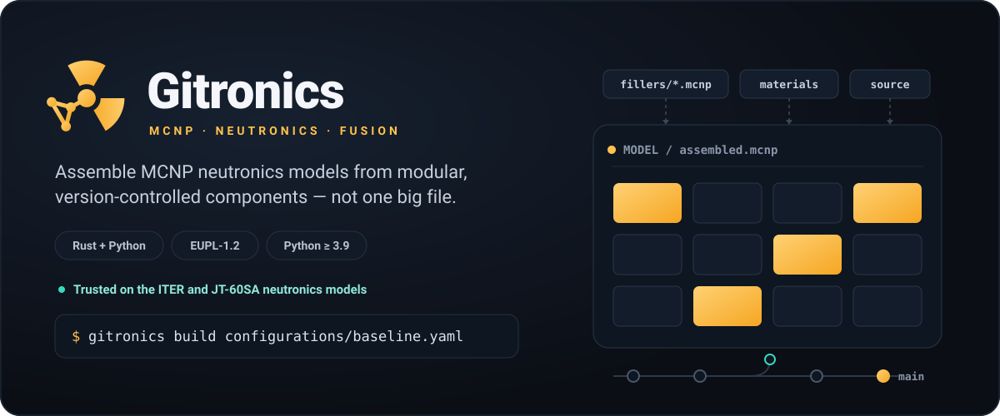
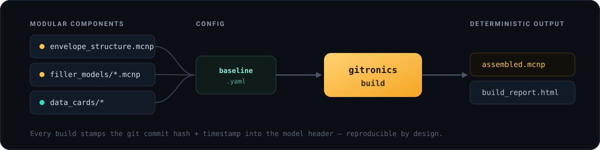

<div align="center">
  
</div>

<p align="center">
  <a href="https://github.com/Fusion4Energy/gitronics/actions/workflows/ci.yml"></a>
  <a href="https://pypi.org/project/gitronics/"></a>
  <a href="https://pypi.org/project/gitronics/"></a>
  <a href="https://github.com/Fusion4Energy/gitronics/blob/main/LICENSE"></a>
  <a href="https://fusion4energy.github.io/gitronics/latest/"></a>
  <a href="https://doi.org/10.1016/j.fusengdes.2025.115248"></a>
</p>

<p align="center">
  <b>Docs:</b> <a href="https://fusion4energy.github.io/gitronics/latest/">fusion4energy.github.io/gitronics</a>
  &nbsp;·&nbsp;
  <a href="https://fusion4energy.github.io/gitronics/latest/getting_started/">Getting Started</a>
  &nbsp;·&nbsp;
  <a href="https://fusion4energy.github.io/gitronics/latest/examples/">Examples</a>
</p>

---

## What is Gitronics?

Large [MCNP](https://mcnp.lanl.gov/) neutronics models are traditionally kept in a **single, enormous input file**. That makes them nearly impossible to review, hard to develop in parallel, and painful to turn into variants.

**Gitronics** is a methodology — and a small, fast tool — for maintaining an MCNP model as a collection of **independent, version-controlled files** that are assembled on demand:

```bash
gitronics build configurations/baseline.yaml -o output/
```

Each file describes one part of the model (a piece of geometry, a set of materials, a source, a group of tallies). A [YAML](https://yaml.org/) configuration declares which pieces to combine and where — so a single `gitronics build` produces one self-contained `assembled.mcnp`.

> The Gitronics methodology already maintains some of the most complex neutronics models of the [ITER](https://www.iter.org/) fusion reactor and the [JT-60SA](https://www.jt60sa.org/) tokamak.

---

## Why it's different

| Monolithic MCNP input | Gitronics project |
| --- | --- |
| One giant file — `git diff` is meaningless | Each component in its own file — diffs are reviewable |
| Variants = copy the whole file and edit | Variants = swap components via config inheritance, zero duplication |
| One person edits at a time | Teams develop sub-models independently, in parallel |
| "Which model produced this result?" | Every build stamps the **git commit hash + timestamp** into the header |

The order of every card in the output is **deterministic**, so two builds of the same configuration are byte-for-byte comparable.

---

## How it works

<div align="center">
  
</div>

`gitronics build` reads a configuration, loads every referenced component, inserts the correct `FILL` cards into the envelope cells, runs validation checks (duplicate IDs, missing cards, …), and writes a single MCNP input plus an HTML build report.

A project is organized like this:

```text
my_project/
├── reference_model/
│   ├── envelope_structure.mcnp     ← level-0 cells (the "shell")
│   ├── filler_models/              ← per-universe MCNP snippets
│   │   ├── universe_101.mcnp
│   │   └── universe_101.metadata
│   └── data_cards/
│       ├── materials/
│       ├── sources/
│       └── tallies/
├── configurations/
│   └── baseline.yaml               ← declares which fillers go where
└── output/
    └── assembled.mcnp              ← produced by `gitronics build`
```

A configuration file simply maps envelope cells to the fillers and data cards that belong in them:

```yaml
project_roots: [..]

envelope_structure: envelope_structure
source: volumetric_source
materials: [materials]
tallies: [fine_mesh]

envelopes:
  blanket_sector_01_r1_c01: universe_101
  blanket_sector_01_r1_c02: universe_103
  divertor_cassette_18: null  # intentionally left empty
```

---

## Installation

Gitronics ships as a Python package with a compiled Rust core. Pre-built wheels are on [PyPI](https://pypi.org/project/gitronics/) — no Rust toolchain required.

```bash
pip install gitronics
```

**Requirements:** Python **3.9+** on Linux, macOS (Intel & Apple Silicon), or Windows x86-64.

<details>
<summary>Build from source</summary>

Requires the stable [Rust toolchain](https://rustup.rs/) and [maturin](https://github.com/PyO3/maturin) ≥ 1.0.

```bash
git clone https://github.com/Fusion4Energy/gitronics
cd gitronics
pip install maturin
maturin develop --release
```
</details>

---

## Quick start

Build the bundled example project:

```bash
cd example_project
gitronics build configurations/valid_configuration.yaml --output-path output/
```

You'll find the assembled model in `output/assembled.mcnp`, with a header recording exactly how it was built:

```text
C ============================================================
C  Built by gitronics v0.1.0
C  Configuration : configurations/valid_configuration.yaml
C  Git commit    : v0.5.18-3-g04d555a
C  Date / time   : 2026-06-23 12:34:51
C ============================================================
```

### Migrate an existing model

Already have a monolithic MCNP input? Split it into a ready-to-build Gitronics project:

```bash
gitronics migrate my_big_model.mcnp -o project/
```

### Python API

The same workflow is available from Python — handy for automation and parametric studies:

```python
import gitronics

# Equivalent to: gitronics build configurations/baseline.yaml -o output/
gitronics.run(["gitronics", "build", "configurations/baseline.yaml", "-o", "output/"])
```

---

## Documentation

The full guide lives at **[fusion4energy.github.io/gitronics](https://fusion4energy.github.io/gitronics/latest/)**:

- [Concepts](https://fusion4energy.github.io/gitronics/latest/getting_started/concepts/) — the vocabulary of a Gitronics project
- [Project Structure](https://fusion4energy.github.io/gitronics/latest/getting_started/project_structure/) & [File Types](https://fusion4energy.github.io/gitronics/latest/getting_started/file_types/)
- [Configuration File](https://fusion4energy.github.io/gitronics/latest/getting_started/configuration_file/) — inheritance, overrides, and variants
- [Building a Model](https://fusion4energy.github.io/gitronics/latest/getting_started/building_a_model/) & [Migrating](https://fusion4energy.github.io/gitronics/latest/getting_started/migrating/)
- [Best Practices](https://fusion4energy.github.io/gitronics/latest/best_practices/)

---

## Citing Gitronics

If Gitronics supports your work, please cite:

> Cubi, A., et al. *Novel modular and Git-based approach for the management and development of radiation transport models.* Fusion Engineering and Design, 2025. [doi:10.1016/j.fusengdes.2025.115248](https://doi.org/10.1016/j.fusengdes.2025.115248)

---

## License

Distributed under the [EUPL-1.2](LICENSE) license.
